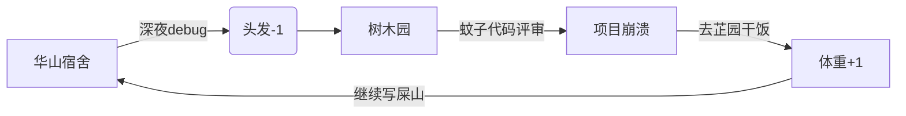

# 😈 华农 IMIS 专业核废料级程序员  
**擅长制造屎山代码 · 专业生产技术负债 · 全栈开发（指前后端一起崩）**  
[](https://github.com/HYH0309)
[](mailto:Y2433936387@163.com)
[](https://space.bilibili.com)

> "紫荆桥下写 bug，芷园饭里找需求，校巴车上改文档" —— IMIS 学子三大人生阶段  

---

## 💩 技术"栈"（祖传屎山配方）

### 编程语言

-3776AB?logo=python)


### 前端开发


### 后端框架


### 数据库


---

## 🗑️ 屎山项目展

### 🤬 [学生管理屎山系统](https://github.com/HYH0309/ShitMountain)
[] 
[]  
**技术栈**：  
- 前端：Vue3 + 未使用的UnoCSS + 类型体操失败  
- 后端：Spring Boot祖传版本 + 裸奔数据库密码  
**特色功能**：
```java
// IMIS经典生存逻辑
if(要写代码 && 要写文档){
    精神分裂();
}else{
    延期毕业();
}
```

### ☢️ [核废料级算法平台](https://github.com/HYH0309/web-work)
[] 
[]  
**架构亮点**：
```
src/
  api/          // 200个API文件管理10个接口
  components/   // 300个组件其中299个只用过一次
  utils/        // console.log的100种封装姿势
```
**成就**：用火箭科学复杂度实现了博客后台功能

---

## 📊 GitHub 惨淡数据
[](https://github.com/HYH0309)
[](https://github.com/HYH0309)

> **数据分析**：  
> - TypeScript使用率90% → 类型体操失败率90%  
> - Java代码占比8% → 祖传屎山维护成本  
> - 其他语言2% → 写demo时临时学的  

---

## 🏫 华农IMIS生存指南

### 🧠 专业课程
| 课程名称 | 实际收获 | 精神伤害 |
|----------|----------|----------|
| 信息系统分析与设计 | 学会画没人看的UML图 | 🤯🤯🤯🤯 |
| 数据库原理与应用 | 精通删库跑路技巧 | 🤯🤯🤯 |
| Web前端开发 | 掌握div+css禅学 | 🤯🤯 |
| 数据结构与算法 | LeetCode刷题从入门到放弃 | 🤯🤯🤯🤯 |

### 🌆 校园开发圣地


---

## ☠️ 屎山开发哲学

1. **绝不重构原则**  
   ```ts
   // 2020年写的垃圾代码
   function calculateGPA() {
     // 看不懂但不敢删
   }
   ```

2. **能抄就抄原则**  
   

3. **在屎山上拉新屎**  
   | 模块    | 真实作用                  |
   |---------|--------------------------|
   | OJ      | 给另一个项目当垫脚石      |
   | Comment | 收集重构时的脏话素材      |
   | SSE     | 让校巴永远不到站的诅咒    |

---

## 📮 联系我（谨慎！）

[](mailto:Y2433936387@163.com)  
**微信**：添加请备注"华农勇士"（会被拉进bug互助群）  

**重构合作须知**：
```diff
- 不接急单（因为不会做）
- 不谈架构（只会复制粘贴）
- 不保证交付（随时跑路去芷园干饭）
```

---

> "代码世界里，每个bug都是通往延毕的阶梯"  
> —— 来自SCAU的IMIS难民  

  
*访问本主页前建议先到行政楼办理《精神损失赔偿申请表》*
