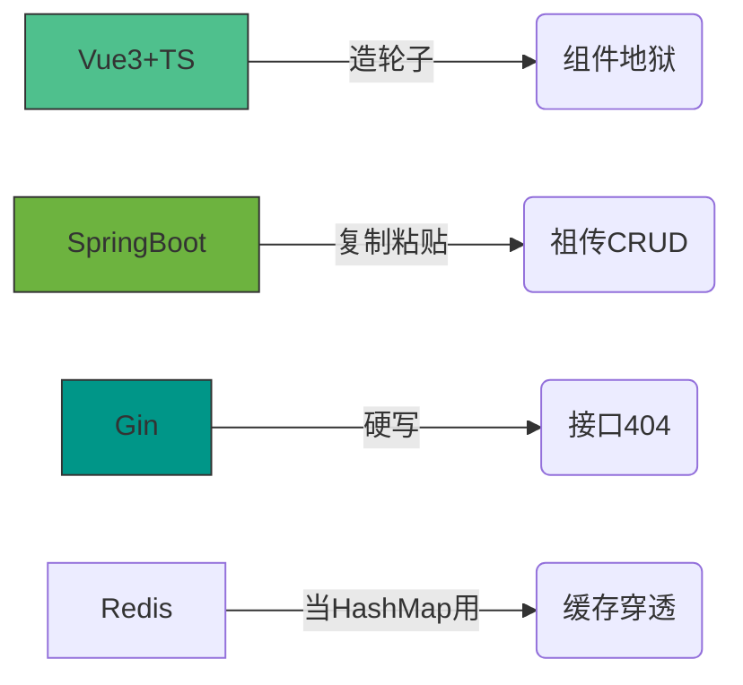
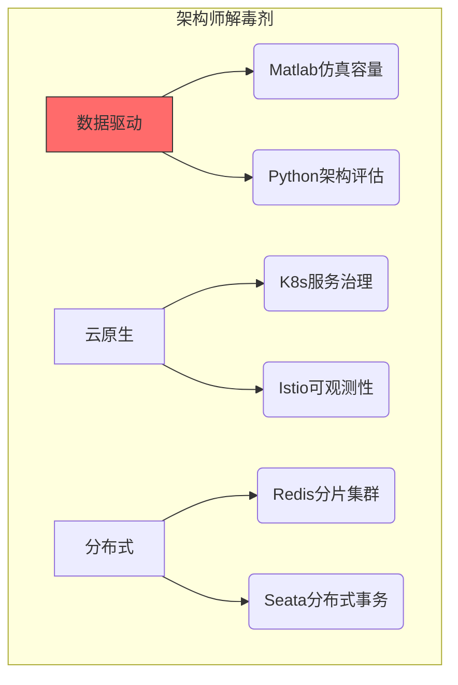

# 😈 华农 IMIS 核废料级程序员 · 架构师（预备役）

**擅长屎山代码重构 · 专业转化技术负债为架构经验 · 伪全栈开发（前后端一起崩但能修好）**

[]()
[]()

> “在紫荆桥下写的 bug，终将成为架构师勋章” —— 自欺欺人版IMIS格言

---

## 🧪 技术毒物表（含解药配方）

| 毒物          | 毒性描述                  | 解毒方案（架构师方向）               |
|---------------|-------------------------|----------------------------------|
| **Vue3+TS**   | 组件地狱深度患者          | `微前端架构` · `WebGL可视化`       |
| **SpringBoot**| 祖传CRUD战士             | `分布式事务` · `JVM调优`           |
| **Gin**       | 高并发从入门到放弃        | `万级QPS优化` · `中间件生态`       |
| **Python**    | import拯救世界           | `Flink实时计算` · `架构健康诊断`   |
| **Redis**     | SET/GET征服者            | `分布式锁` · `流处理`              |
| **Rust**      | 编译器一生之敌            | `内存安全实战` · `异步编程`         |

---

## 🚧 屎山改造计划

### 🔨 在产屎中学习（当前技能）



### 🏗️ 屎山重建蓝图（学习方向）



---

## 🗿 华农IMIS修仙指南

### 专业课程真相

| 课程名               | 官方教材          | 实战收获                  |
|---------------------|-----------------|-------------------------|
| 系统分析与设计      | UML图大全        | 如何把简单需求画成迷宫      |
| 数据库原理          | 三范式理论        | 删库跑路的一百种姿势        |
| 数据结构与算法      | 《算法导论》      | LeetCode从入门到住院       |

### 校园开发圣地

```
 泰山宿舍 -- debug到凌晨 --> 芷园夜宵
     ↑                      ↓
 技术负债增加          体重增加+1
     ↑                      ↓
 行政楼<--提交延期申请-- 教学楼
```

---

## 💣 核心理念：在屎山上建金字塔

```diff
// 2024年战略升级版屎山
function calculateGPA() {
-   // 看不懂但不敢删的祖传代码
+   // 用Rust重写的防崩溃模块
+   // 经Matlab验证的算法
}
```

**屎山开发新原则：**

1. 每坨新屎必须包含单元测试（哪怕测试也是屎）
2. 抄代码要注明来源（方便甩锅）
3. 在祖传屎山上用Rust建造安全屋

---

## 📈 技术负债转化方案

| 负债资产          | 证券化方案                  | 预期收益              |
|------------------|---------------------------|---------------------|
| Vue组件地狱       | 微前端隔离方案              | 维护成本↓30%         |
| SpringBoot祖传CRUD| DDD领域重构                | 扩展性↑200%          |
| Redis缓存穿透     | 布隆过滤器防护              | 服务器费用↓40%        |

---

> “从紫荆桥下的bug猎人，到珠江新城的架构师——  
> 我们终将把技术负债变成架构资本”  
> —— 华农IMIS跑路未遂者  

[](mailto:Y2433936387@163.com)
[](https://github.com/HYH0309)

```
