# 😈 华农 IMIS 核废料级程序员 · 架构师（预备役）

**擅长屎山代码重构 · 专业转化技术负债为架构经验 · 伪全栈开发（前后端一起崩但能修好）**

[]()
[]()

> “在紫荆桥下写的 bug，终将成为架构师勋章” —— 自欺欺人版IMIS格言

---

## 🧪 技术毒物表（含解药配方）

| 毒物          | 毒性描述                  | 解毒方案（架构师方向）               |
|---------------|-------------------------|----------------------------------|
| **Vue3+TS**   | 组件地狱深度患者          | `微前端架构` · `WebGL可视化`       |
| **SpringBoot**| 祖传CRUD战士             | `分布式事务` · `JVM调优`           |
| **Gin**       | 高并发从入门到放弃        | `万级QPS优化` · `中间件生态`       |
| **Python**    | import拯救世界           | `Flink实时计算` · `架构健康诊断`   |
| **Redis**     | SET/GET征服者            | `分布式锁` · `流处理`              |
| **Rust**      | 编译器一生之敌            | `内存安全实战` · `异步编程`         |

---

## 🚧 屎山改造计划

### 🔨 在产屎中学习（当前技能）

```mermaid
graph LR
    A[Vue3+TS] -->|造轮子| B(组件地狱)
    C[SpringBoot] -->|复制粘贴| D(祖传CRUD)
    E[Gin] -->|硬写| F(接口404)
    G[Redis] -->|当HashMap用| H(缓存穿透)
    style A fill:#4FC08D,stroke:#333
    style C fill:#6DB33F,stroke:#333
    style E fill:#009688,stroke:#333
```



### 🏗️ 屎山重建蓝图（学习方向）

```mermaid
graph TB
    subgraph 架构师解毒剂
        A[数据驱动] --> B(Matlab仿真容量)
        A --> C(Python架构评估)
        D[云原生] --> E(K8s服务治理)
        D --> F(Istio可观测性)
        G[分布式] --> H(Redis分片集群)
        G --> I(Seata分布式事务)
    end
    style A fill:#FF6B6B,stroke:#333
```

---
## 🚀 技术项目全景

### 💻 全栈应用
| 项目 | 技术栈 | 亮点 | 状态 |
|------|--------|------|------|
| **[学生管理系统](https://github.com/HYH0309/student-manage-system)**<br>Vue3+SpringBoot信息平台 |     | 响应式UI设计 · 教务场景深度适配 |  |
| **[IMISLab](https://github.com/HYH0309/IMISLab)**<br>实验室综合管理平台 |    | 算法可视化 · 自动化脚本集成 |  |
| **[博客系统](https://github.com/HYH0309/Blog)**<br>Gin+Vue3+Tauri跨端方案 |    | Web/桌面双端支持 · Rust高性能封装 |  |

### 🛠️ 工具链
| 项目 | 技术栈 | 亮点 | 类型 |
|------|--------|------|------|
| **[CVue CLI](https://github.com/HYH0309/cvue)**<br>Rust版Vue模板工具 |   | 模板生成速度提升3倍 · 跨平台支持 |  |
| **[前端模板](https://github.com/HYH0309/template)**<br>标准化Vue3启动套件 |    | 开箱即用 · 企业级工程配置 |  |

### ⚡ 创新探索
| 项目 | 技术栈 | 亮点 | 成果 |
|------|--------|------|------|
| **[算法可视化](https://github.com/HYH0309/web-work)**<br>Vue3算法教学平台 |    | 动态演示核心算法 · 交互式学习体验 |  |
| **[待办应用](https://github.com/HYH0309/Todo)**<br>Vue+Rust全栈实践 |   | WASM集成 · 零依赖桌面应用 |  |
| **[音乐播放器](https://github.com/HYH0309/Music-Player)**<br>Java Swing桌面应用 |   | 轻量级实现 · 经典GUI编程实践 |  |
## 🗿 华农IMIS修仙指南

### 专业课程真相

| 课程名               | 官方教材          | 实战收获                  |
|---------------------|-----------------|-------------------------|
| 系统分析与设计      | UML图大全        | 如何把简单需求画成迷宫      |
| 数据库原理          | 三范式理论        | 删库跑路的一百种姿势        |
| 数据结构与算法      | 《算法导论》      | LeetCode从入门到住院       |

### 校园开发圣地

```
 泰山宿舍 -- debug到凌晨 --> 芷园夜宵
     ↑                      ↓
 技术负债增加          体重增加+1
     ↑                      ↓
 行政楼<--提交延期申请-- 教学楼
```

---

## 💣 核心理念：在屎山上建金字塔

```diff
// 2024年战略升级版屎山
function calculateGPA() {
-   // 看不懂但不敢删的祖传代码
+   // 用Rust重写的防崩溃模块
+   // 经Matlab验证的算法
}
```

**屎山开发新原则：**

1. 每坨新屎必须包含单元测试（哪怕测试也是屎）
2. 抄代码要注明来源（方便甩锅）
3. 在祖传屎山上用Rust建造安全屋

---

## 📈 技术负债转化方案

| 负债资产          | 证券化方案                  | 预期收益              |
|------------------|---------------------------|---------------------|
| Vue组件地狱       | 微前端隔离方案              | 维护成本↓30%         |
| SpringBoot祖传CRUD| DDD领域重构                | 扩展性↑200%          |
| Redis缓存穿透     | 布隆过滤器防护              | 服务器费用↓40%        |

---

> “从紫荆桥下的bug猎人，到珠江新城的架构师——  
> 我们终将把技术负债变成架构资本” 
> —— 华农IMIS跑路未遂者  

[](mailto:Y2433936387@163.com)
[](https://github.com/HYH0309)

```
